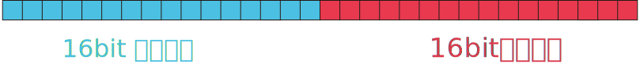

# FORCE 开发手册：计算机和浮点数
## 实数——由连续到离散

数学当中我们对实数的定义是“有限小数和无限小数的统称”，若我们将这个概念简化，那么实数实际可以理解为所有小数的集合。
然而在计算机当中，并不存在“无限”这种东西，换言之计算机是“离散”的，它所存储的所有数据都有它明确的值。举个例子来说
$$\pi = 3.1415926535 \dots$$
后面的内容可以不断循环，但是这样的东西要怎么让计算机存储呢？要知道 $\pi$ 是个无理数，它是无限不循环的，或者说，实数本身就具有“完备性”，它们对应数轴上的点，是可以小到填满任何一个缝隙也可以达到延至宇宙尽头的值；无穷小——不是确定值，无穷大——也不是确定值，甚至 $\frac{1}{3}$还有$\mathrm{e}$这样的数字都不确定。但对于计算机来讲，不是确定的值是没有办法存储的。于是乎计算机只能做出一些舍弃，舍弃一些精度，用近似来代替。比如说
$$\sqrt{2} = 1.41421\dots$$
那么计算机就会将其 **“截断”** 只保留一部分，所以最终存储在计算机当中的就是
$$\sqrt{2} = 1.41421$$
这是计算机不得不对实数的保存做出的妥协。但是在实际应用层面是不需要完整的实数值的，一般来说哪怕是最为精确的航天工业，保留小数点后 $16$-$17$ 位也是绰绰有余。

## 直觉存储——定点数
我们明确了计算机存储实数的原理，那么让我们设计一种标准来保存实数，将数字量转换为内存布局。那么首先能够想到的肯定是“存一个小数还不容易，我只要把一段内存前半段保存整数部分，后半段保存小数部分，中间加一个点不久完事了嘛”。是这么做可行但不合理，因为仔细想一想这么做会导致存储的数值区间范围非常的小。

譬如，我们有 $32$ 个坑位（$32$ bit）来近似一个实数，我们就想到，让高 $16$ 位存储整数部分，低 $16$ 位存储小数部分，那么整体的内存应该是这样布局的

可是我们来计算一下，对于整数部分，如果所有 $16$ 位全部为 $1$ 根据等比数列的求和公式，我们就可以得到其最大的整数值
$$\sum_{i=0}^{16-1}{2^i} = \frac{2^{16}-1}{2-1}=65535$$
对于小数部分，我们也用同样的方法计算一下就是
$$\sum_{i=1}^{16}{2^{-i}} = \frac{0.5^{16}-1}{0.5-1}=1.999969482421875$$
再将两个部分加起来就得到存储上限就是
$$65535 + 1.999969482421875 = 65536.999969482421875$$
而存储下限自然就是 $0$ 所以我们就得到了这种内存布局的$32$位浮点数的值表示范围
$$[0,65536.999969482421875]$$
但是还不够，我们没有办法表示正负，那不妨将整数位阉割掉最高位用来存储符号，其余 $31$ 位存储绝对值，我们就得到了有符号存储区间
$$[-32,768.999969482421875,32,768.999969482421875]$$
该方法的致命缺陷这就体现出来了——**范围太小了**

上下值的范围如果要是近似下，那不过 $[-2^{15},2^{15}]$ 。这个范围对于一整个实数域来说显然是小之又小，同样占用 $32$ 位的整数都可以保存到 $2^{31}$ 。然而就算是保存小数，其精度也不够。比如
$$1.3$$
如果我们将其转化为二进制小数，那它应该是：
$$1.0\dot{1}00\dot{1}$$
我们再将其放到内存里表示，就应该是

将实际的存储值转回十进制就是：
$$1.29998779296875$$
再做差分析误差
$$\delta = 1.29998779296875 - 1.3 = -0.00001220703125$$ 
我们其实可以由此推导普遍结论，就是**存储值总是**$\leq$**实际值**，而且二进制小数的循环节越长，误差也就越大。
但是碰到$1.5$或者$1.0125$这样的数字却可以完美表示。

以上的方法就被称为**定点数**定点数存储由于小数点位置固定，所以不仅存储范围小，而且精度也不能被保证。但是，在计算机发展的初级阶段，由于没有大量存储需要，所以该方法在上世纪 $80$ 年代以前，业内没有统一实数存储标准以前该方法应用还是非常广的。

## 科学存储——浮点数
### 基本认识
随着计算机高速发展，到了 $80$ 年代，业内对高精度计算和高速度计算的需求越来越大，而同时，定点数在面对实数的存储时既没有空间优势，也没有精度优势，已经处于被淘汰的边缘。业内急需一种新的实数存储标准来应对需求的激增。于是**浮点数**应运而生。

浮点数也是现行的实数存储标准，它的第一代规范叫做 ***IEEE Std 754-1985*** (I-Triple-E-754)现行最新标准是 2008 年修正过的。这个标准就是大名鼎鼎的 ***IEEE754***。现今的绝大多数编程语言，其中默认带有的类型 **float** 或者 **double** 就是该标准下的浮点数。（C语言虽然是1972年诞生的，但第一代C标准——ANSI C是1989年诞生的，所以即使 C 本身比浮点数年龄大，但是它仍然使用浮点数处理实数）

浮点数的设计受到了科学计数法的启发，一个十进制数可以被写成
$$ \pm1\times 1.*** \times 10^n$$
那么一个二进制数也可以被写作
$$ \pm1\times 1.*** \times 2^n$$
后面的指数部分我们其实就可以看作小数点的偏移。

思路有了，观察一下科学计数法形式的二进制数，它由三个部分构成，第一个是最前面的 $\pm1$ 我们称之为 **符号(Sign)** 将 $n$ 称为 **指数(Exponent)** 最后的 $1.***$ 称为 **尾数(Mantisa)**。我们的脑中自然就有了一个设想，如果能让一段内存保存这三个部分，那不就等于保存了一个实数值嘛。

现在，我们以$32$位为例，来看一下 ***IEEE754*** 是怎么做的。***IEEE754*** 首先就是将$32$位拆解为了$3$个部分，最高位只需一位通过零一来表示正负，然后用连续的$8$位来存储指数，最后剩下的$23$位全部用来存储尾数，画成图就是这样的

我们把图中所示的三个部分的值分别用字母$S,E,M$表示，那么一个$32$位浮点数的十进制值$F$可以通过以下公式得出
$$F = (-1)^S \cdot 2^{E-127} \cdot (1+M)$$
$S$正数为$0$负数为$1$可以表示符号，而$127$的出现是由于***IEEE754*** 希望指数部分的值不需要保存符号，换言之让$E\geq0$，所以要减去这个偏移才能实现小数点往右移，偏移$O$的公式是
$$O = 2^{E_b-1}-1$$
其中的 $E_b$ 就是 $E$ 所占的位数。

最后$(1+M)$里的$1$是由于所有科学计数法表示的实数都是$1.***$的形式，所以总有一个$1$我们可以不保存，最后加上就可以了，这叫做“归一化”小数。

除此之外，**浮点数存在几个特殊值**，它们分别是$\pm0$ $\pm\infty$ 还有 $\mathrm{NAN}$(Not A Number)。$0$就是除了第一位符号位之外其他位全部为$0$的情况，正负视第一位情况而定；$\infty$则类似，是指数位全为$1$，尾数位全为$0$；最后$\mathrm{NAN}$的定义则是指数位都为$1$尾数位不为$0$。

浮点数有几个不同大小的类型，在大多数编程语言里比较常用的是“单精度”和“双精度”类型，所以这里就只给出它们两个的规格信息

|名称|规格|总大小|符号位大小|指数位大小|尾数位大小|精度|
|--- |---| ---  |  ---    |  ---    |   ---   |--- |
|float|单精度|4字节|1bit|8bit|23bit|6~7位|
|double|双精度|8字节|1bit|11bit|52bit|15~16位|

### 实际应用
将$1.3$换算为$32$位***IEEE754***的形式。

首先，已经明确的，其二进制小数形式是
$$1.0\dot{1}00\dot{1}$$
将最前面的$1$去掉由于不需要移动小数点所以$E-127=0$于是$E=127$也就是$(01111111)_{\mathrm{bin}}$，然后只保留尾数的前$23$位即
$$(01001100110011001100100)_{\mathrm{bin}}$$
然后，由于是正数，所以符号位填补的自然是0，那么最后我们就得到了$1.3$的***IEEE754***形式：

