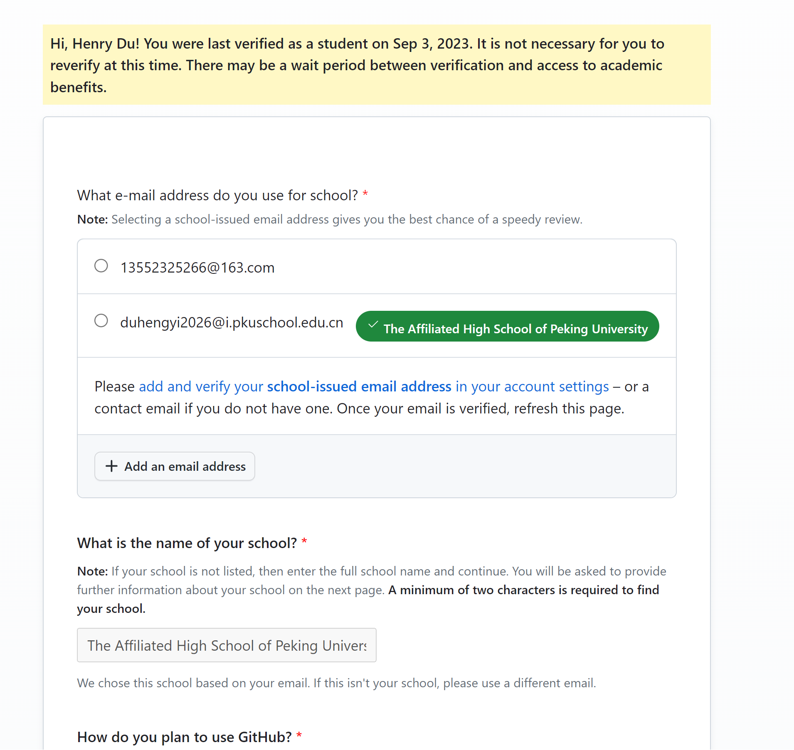

# 如何用北大附中邮箱白嫖 github pro

## 第一步拥有校网邮箱
拥有校网邮箱十分的容易，只需要成为“北京大学附属中学”的学生，然后就拥有了一个 [姓名][届别]@i.pkuschool.edu.cn 的邮箱。
## 第二部申请 github benefits
这个 "edu.cn" 邮箱可以白嫖 github benefits.
第一步在浏览器中打开链接 “https://education.github.com/discount_requests/application”
第二步在图示的界面中选择“Student”

第三步向下翻页到图示界面

然后选择“Add an email address”直接输入自己的教育邮箱，这一步可能需要到 github 验证一下。

最后可能会需要提交照片进行进一步验证。到了这一步直接将北大附中的录取通知书带有姓名的那一面拍照上传即可。